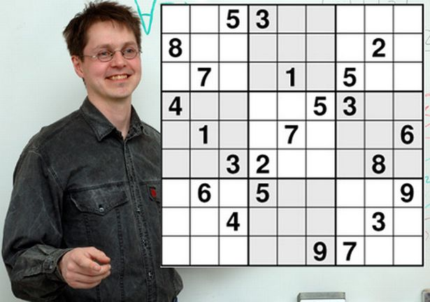
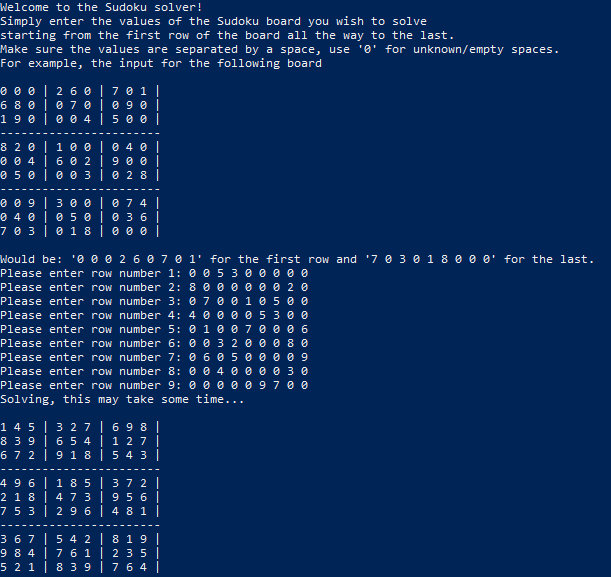

# Sudoku-Solver-Python
This is a Sudoku Solver that I worked on years ago. It was one of my first Programming projects. I made use of both generative recursion and backtracking to create the Sudoku Solver. I also tried my best to implement some UI (all text based), alongside some exception handeling. Overall, looking back I'm still pretty happy with the project, especially considering where I was at the time programming wise.  

However, one thing I would change would be the way I chose to abstract the Sudoku board. In the program I simply consider the board to be a list of values, and I map the index to its relevant column and row. Due to this I have a bunch of global variables that do the mapping for me (from index to column/row/nonet). Instead I could have just had a list containing (column, row) tuples, this would map the index to the relevant column/row much more intuitively and eliminate the need for some helper functions. Overall working to make reasoning about the program that much easier.  

To test the program I entered the "World's hardest sudoku"  
  
  
Here is the solution  

